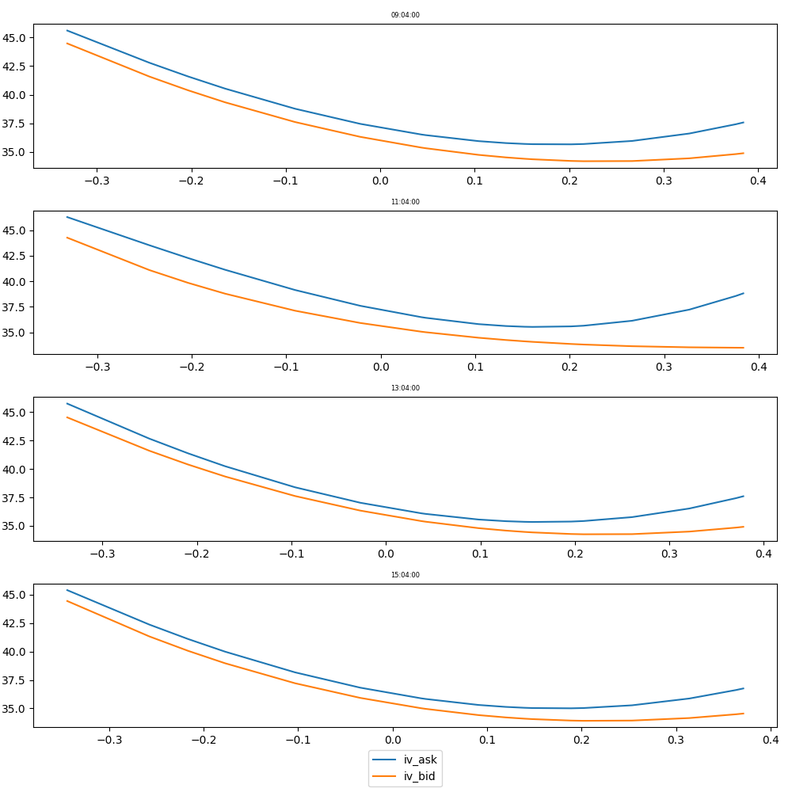
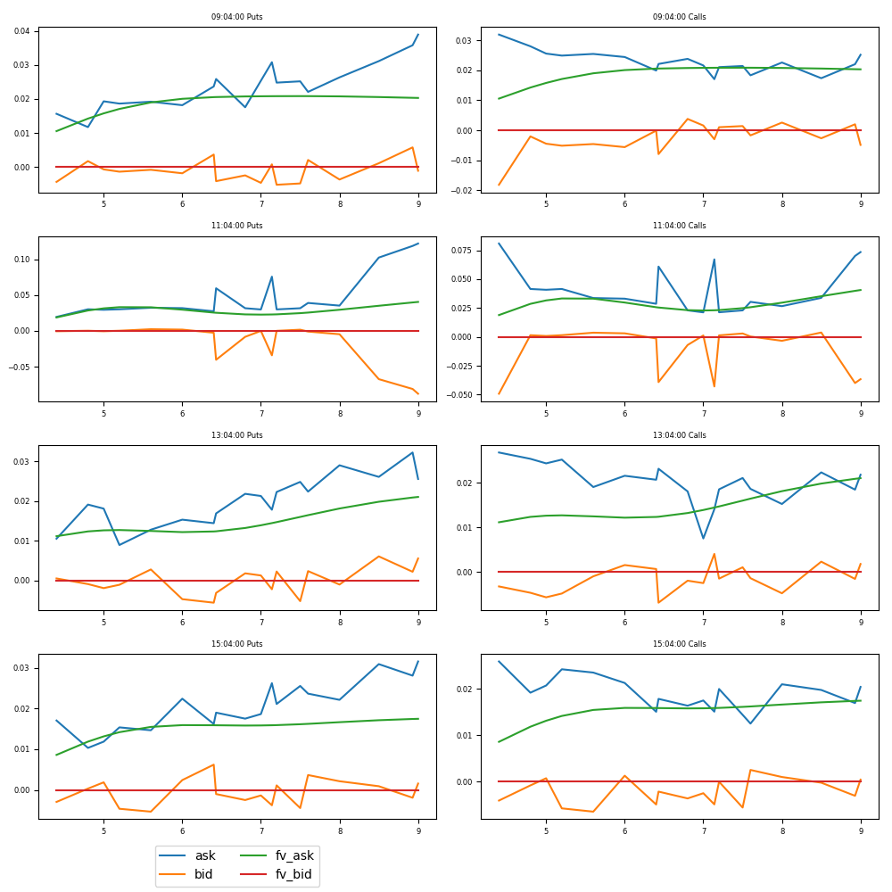

# Calibrating-implicit-volatility-surface-with-Deutsche-Boerse-A7
How to retrieve options intraday data from Deutsche Boerse A7 and calibrate a volatility surface
offered by Deutsche Boerse.
For this, please go to :
https://www.mds.deutsche-boerse.com/mds-en/analytics/A7-analytics-platform

Once you have been registered as a A7 user, please connect to the A7 website in order to get an API key.
https://a7.deutsche-boerse.com/

Once you have logged in, click on the face icon next to your name on the top right of the page and then select API Token generation.
A general example of how to retrieve data from the API is given at https://deutsche-boerse.github.io/a7/usecases/02_simple_rdi.html

The Trades_Dynamics Jupyter Notebook provided here provided here build on the knowledge shown in this usecase to retrieve all data from each relevant option for a designated underlying and the calibrate a volitility surface.
This volatility can then be shown as a time series or used in more advances examples such as :
https://github.com/a7/Trades-Dynamics-with-Deutsche-Boerse-A7
https://github.com/a7/Timing-Disperions-Strategies-with-Deutsche-Boerse-A7
https://github.com/a7/Defining-Idiosyncratic-Volatility-with-Deutsche-Boerse-A7

You will need a Python 3.8 interpreter with the following packages :
- QuantLib
- numpy, pandas
- math, datetime, matplotlib
- sklearn, scipy
- requests, warnings

You will also need to download the python files provided in this git :
DateAndTime.py, PricingAndCalibration.py, SetUp.py

Here is the kind of graph that you can generate. (More details in the Jupyter Notebook)

Vol Calibration:

Market Prices vs Faire Prices

